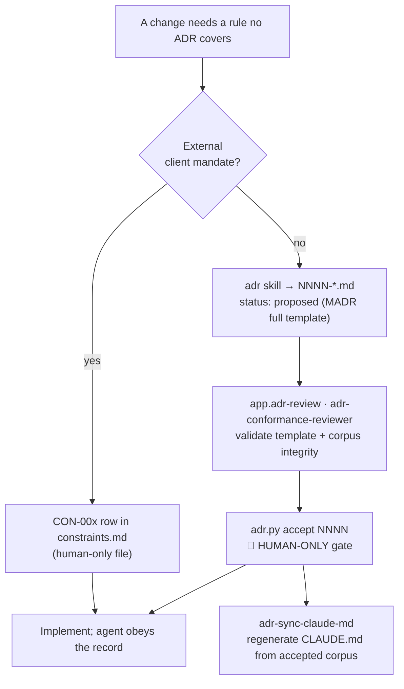
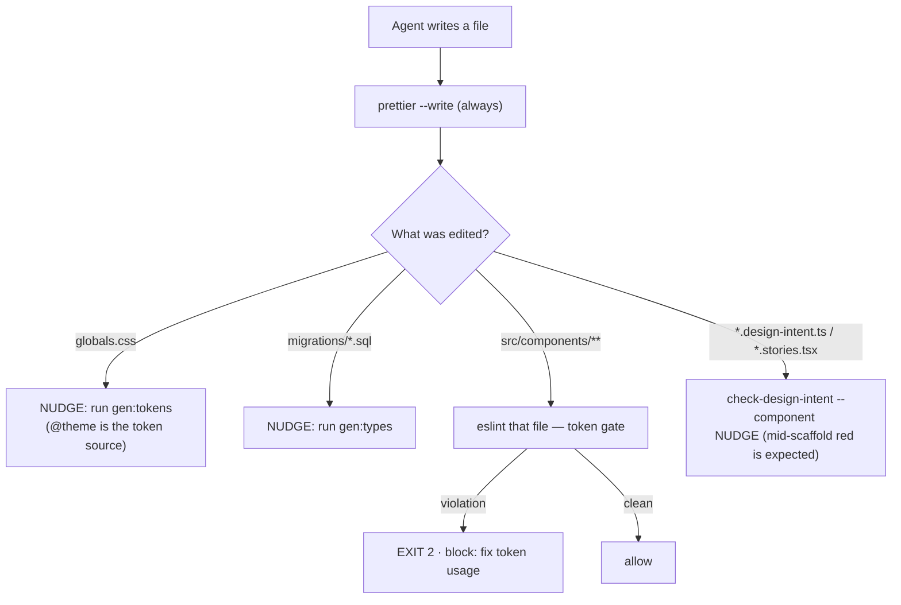
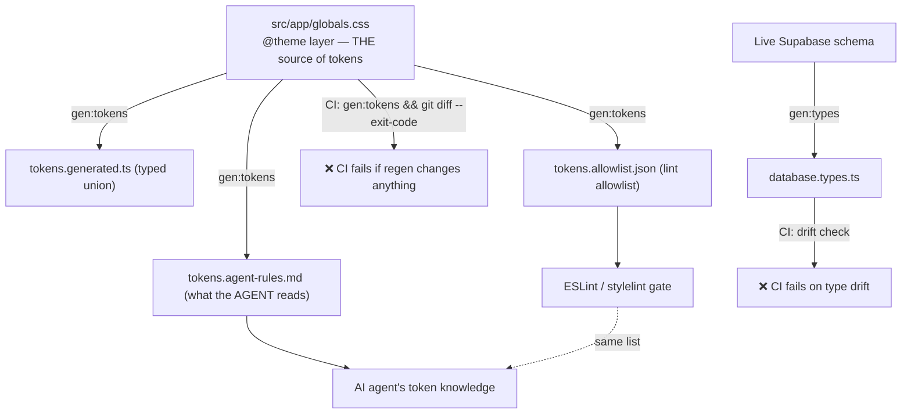
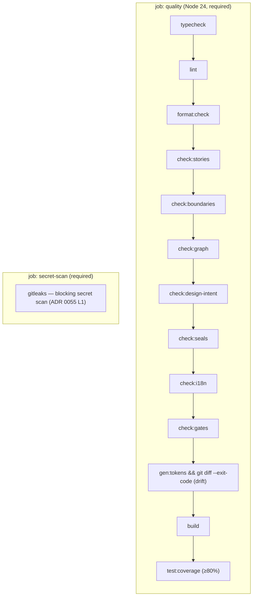
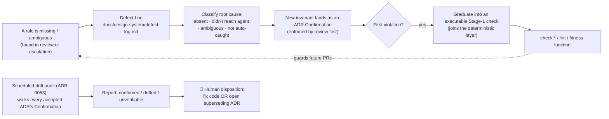
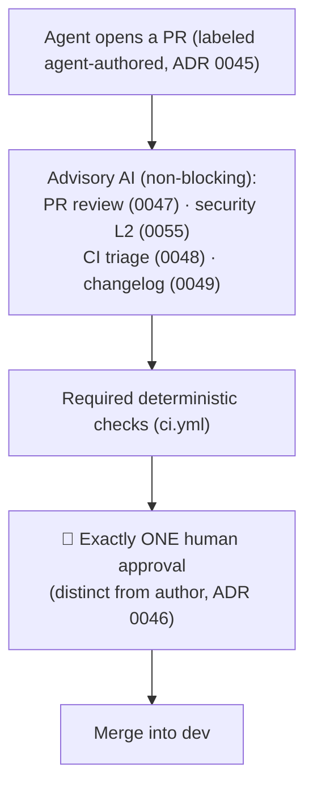

# Deterministic Guardrails for the AI Agent

> How this repository constrains a non-deterministic implementer (an LLM) with
> deterministic machinery — what blocks mistakes, what rules exist, how feedback
> flows, and what every rule is grounded in.

This project is built **decisions-first** with an **AI agent as the primary
implementer** ([ADR 0045](docs/decisions/0045-ai-agent-role-and-attribution.md)). An
agent's output is only trustworthy when the rules it works under are
**machine-checkable, generated from a single source, and proven to enforce
themselves** — prose conventions rot, gates don't. This document explains that
enforcement layer end to end.

For the high-level principles see the README's
[Principles section](README.md#principles--deterministic-ai-driven-development); this
document is the detailed, diagrammed companion.

---

## 1. The core premise

An LLM is a **probabilistic** writer. It can hallucinate a token name, invent a prop,
import across a boundary it shouldn't, or silently skip a state. The defense is not
"make the model never err" — it is to surround the probabilistic writer with
**deterministic verifiers** so that any single error has to survive _multiple
independent mechanical checks_ to reach `main`.

```
        NON-DETERMINISTIC                 DETERMINISTIC
        ┌─────────────┐      writes       ┌───────────────────────────┐
        │  AI agent   │ ───────────────►  │  hooks · gates · codegen  │
        │  (LLM)      │                   │  drift checks · CI        │
        └─────────────┘  ◄─────────────── └───────────────────────────┘
                            feedback        every rule reads real files,
                                            asserts an invariant, fails loudly
```

Three properties make a rule a _guardrail_ rather than a suggestion:

| Property              | Meaning                                               | Mechanism in this repo                     |
| --------------------- | ----------------------------------------------------- | ------------------------------------------ |
| **Machine-checkable** | a script decides pass/fail, not a human reading prose | `check:*` scripts, ESLint, `adr.py lint`   |
| **Single-sourced**    | the rule the agent reads == the rule CI enforces      | `gen:tokens`, `gen:types` + CI drift check |
| **Self-enforcing**    | the gate is proven to reject a real violator          | `check:gates` (P6)                         |

---

## 2. Defense in depth — the three layers

Every rule lands in **exactly one** of three layers, chosen by the _kind of guarantee_
it needs. This is the spine of the whole design
([the design-system plan §1](docs/design-system-ai-tooling-plan.md)).

```
                      ▲  fewer rules, irreducible judgment
                     ╱ ╲
                    ╱   ╲      JUDGMENT  (human gates)
                   ╱     ╲     intent collisions · baseline approval
                  ╱───────╲    accepting ADRs · merges · secrets · prod
                 ╱         ╲
                ╱           ╲   STRUCTURAL  (skills + graphs, WARN)
               ╱             ╲  recall over precision — reduce violations
              ╱               ╲ inside the agent loop. ds:* helpers, skills
             ╱─────────────────╲
            ╱                   ╲  DETERMINISTIC  (CI gates, BLOCK)
           ╱                     ╲ precision over recall — green == property
          ╱_______________________╲ holds. token lint, boundaries, fitness
                                     functions, drift checks, coverage
              more rules, mechanical
```

| Layer             | Guarantee                                                 | Failure mode          | Where it lives                                      |
| ----------------- | --------------------------------------------------------- | --------------------- | --------------------------------------------------- |
| **Deterministic** | _Precision_ — a green gate means the property holds       | Blocks merge (CI red) | `check:*`, ESLint, `tsc`, coverage, `adr.py lint`   |
| **Structural**    | _Recall_ — lowers violation frequency in the agent's loop | Warns / nudges        | `ds:*` helpers, `.claude/skills/*`, post-edit hints |
| **Judgment**      | The irreducible human call                                | Requires a person     | Human-only gate list (§8)                           |

The layers are ordered by **range from the keystroke**: structural helpers fire while
the agent is _deciding_, deterministic gates fire when it _writes_ and again in _CI_,
human judgment fires at the _merge / accept / promote_ boundary.

---

## 3. Where each guardrail fires — the timeline

A single change passes through up to four mechanical checkpoints before a human ever
looks at it. None of them trusts the previous one.

```mermaid
flowchart LR
    subgraph think["① While deciding (STRUCTURAL · warn)"]
        S1["ds:signature — duplicate check"]
        S2["ds:states — mandatory state set"]
        S3["skills: new-component, story-matrix"]
    end
    subgraph edit["② On every edit (HOOKS · block/nudge)"]
        H1["PreToolUse: guard-protected-files\nblocks forbidden writes"]
        H2["PostToolUse: post-edit-checks\nprettier · scoped eslint · drift nudges"]
    end
    subgraph local["③ Before PR (DETERMINISTIC · block)"]
        L1["pre-pr-gate skill\ntypecheck · lint · check:* · build · coverage"]
    end
    subgraph ci["④ CI on PR (DETERMINISTIC · required)"]
        C1["quality job — 13 ordered steps"]
        C2["secret-scan — gitleaks"]
    end
    subgraph human["⑤ Merge (JUDGMENT · human-only)"]
        HU["1 human approval, distinct from author\nadvisory AI comments inform, never gate"]
    end

    think --> edit --> local --> ci --> human
```



The key invariant: **green local == green CI**. The same `check:*` scripts run in the
`pre-pr-gate` skill and in `ci.yml`, so the agent can close the loop locally before
asking for human review.

---

## 4. Foundation — decisions before code

Nothing lands without a covering decision. The rule the agent obeys _starts_ as a
human-ratified record.



What makes this deterministic rather than honor-system:

- **Immutability.** An `accepted` ADR is **never edited in place** — a change requires a
  new _superseding_ record with paired links, done via `adr.py supersede`
  ([ADR 0001](docs/decisions/0001-record-decisions-as-madr-adrs.md)). A
  PreToolUse hook (§5) physically blocks the agent from editing an accepted record.
- **Corpus integrity is itself a check.** `adr.py lint` validates numbering (unique,
  gap-free), cross-references (every `ADR-NNNN`/`CON-00x` resolves), required MADR
  sections present, no unfilled `{placeholders}`, valid status vocabulary, and that the
  generated `README.md` index matches disk. Exposed as the `adr-audit` skill.
- **The agent's own instructions are generated.** `CLAUDE.md` (the agent's standing
  brief) is regenerated from the _accepted_ corpus by `adr-sync-claude-md` — not
  hand-maintained, so it cannot drift from the decisions.
- **Acceptance is human-only.** An agent may _draft_ and _review_ an ADR; it may never
  set `status: accepted`. That transition is the first human gate.

**Current corpus:** 66 ADRs (0001–0066, gap-free), 63 accepted, 2 superseded
(0025→0065 token architecture, 0034→0057 Storybook 10), and 1 proposed (0066, the
template's neutral token baseline, superseding 0065 pending acceptance), plus 3
client-mandate constraints (CON-001 React, CON-002 Next.js, CON-003 the MCP toolchain).

---

## 5. Edit-time guardrails — Claude Code hooks

Hooks turn CLAUDE.md _prose_ into _mechanical enforcement_ at the moment the agent
touches a file. They are the closest guardrail to the keystroke.

### PreToolUse — `scripts/hooks/guard-protected-files.mjs`

Matches `Write | Edit | NotebookEdit | Bash`. Exits `2` (block, with reason) or `0`
(allow). **Fails open** on unexpected errors — a buggy hook must never brick every edit.

| What it blocks                                         | Why                                          | Grounded in                                                                |
| ------------------------------------------------------ | -------------------------------------------- | -------------------------------------------------------------------------- |
| `vitest -u` / `--update` snapshot regen                | Baselines update only as a reviewed action   | [ADR 0039](docs/decisions/0039-snapshot-testing-policy.md)                 |
| Writes to `.env`, `.env.local`, … (not `.env.example`) | Secrets are human-provisioned, never tracked | [ADR 0020](docs/decisions/0020-secrets-and-environment-variables.md), 0045 |
| Edits to `docs/decisions/constraints.md`               | Client-mandate registry is human-only        | [ADR 0045](docs/decisions/0045-ai-agent-role-and-attribution.md)           |
| Writes to `tailwind.config.*`                          | CSS-first `@theme` only, no config file      | [ADR 0024](docs/decisions/0024-styling-tailwind-css.md)                    |
| In-place edits to an `accepted` ADR                    | Records are immutable; supersede instead     | [ADR 0001](docs/decisions/0001-record-decisions-as-madr-adrs.md)           |

### PostToolUse — `scripts/hooks/post-edit-checks.mjs`

Matches `Write | Edit`. Surfaces deterministic feedback _in the agent's loop_, before CI.



- **Blocking** (exit 2): token/lint violations in `src/components/**` — caught the
  instant they're written ([ADR 0058](docs/decisions/0058-token-usage-enforcement-and-codegen.md)).
- **Non-blocking nudges** (`additionalContext`): codegen-drift reminders and scoped
  design-intent feedback, where a transient red state mid-scaffold is normal.

---

## 6. The deterministic gates — `check:*`

These are the CI-blocking mechanical checks. Each reads real files, asserts an
invariant, and fails loudly. `npm run check:design-system` bundles the design-system
subset.

| Gate                  | Script                        | What it deterministically rejects                                                        | ADR                                                                        |
| --------------------- | ----------------------------- | ---------------------------------------------------------------------------------------- | -------------------------------------------------------------------------- |
| `check:stories`       | `check-component-stories.mjs` | A `src/components/**` module with no colocated stories                                   | [0041](docs/decisions/0041-component-story-coverage-policy.md)             |
| `check:boundaries`    | `depcruise src`               | primitive→composite imports · non-`index.ts` cross-imports · cycles · orphans            | [0060](docs/decisions/0060-module-boundary-dependency-cruiser.md)          |
| `check:graph`         | `check-composition-graph.mjs` | Composition graph (`composedOf`/`usedIn`) diverging from the real import graph           | [0059](docs/decisions/0059-component-composition-dependency-graph.md)/0060 |
| `check:design-intent` | `check-design-intent.mjs`     | API↔props mismatch · uncovered archetype states · states↔stories drift · missing play fn | [0062](docs/decisions/0062-design-intent-spec-and-api-derivation.md)       |
| `check:seals`         | `check-figma-seals.mjs`       | Malformed/absent Figma approval seals (inert until a Figma file is wired)                | [0063](docs/decisions/0063-anti-hallucination-approval-and-drift-seal.md)  |
| `check:i18n`          | `check-i18n-parity.mjs`       | Missing locale keys · broken ICU syntax                                                  | [0054](docs/decisions/0054-localization-ai-first-translation.md)           |
| `check:tokens`        | `eslint src/components`       | Raw hex/CSS-color · inline-style raw values · raw SVG fill/stroke · numbered Tailwind    | [0058](docs/decisions/0058-token-usage-enforcement-and-codegen.md)         |
| `check:gates`         | `check-gates.mjs`             | **A gate that fails to reject its own planted violator** (see §7)                        | 0058/0059/0060/0054                                                        |

---

## 7. Single source of truth — anti "knowledge laundering"

The most subtle failure mode is an agent obeying a rule that _looks_ authoritative but
has quietly drifted from what CI enforces. The defense: anything the agent must obey is
**generated** from one canonical source and **drift-checked in CI**.



Because the **lint allowlist** and the **agent-rules reference** are emitted from the
_same_ `gen:tokens` pass over the _same_ `@theme` block, the rules the agent reads and
the rules CI enforces **cannot silently diverge**. CI runs `gen:tokens` / `gen:types`
and fails on any `git diff` — the generated artifacts are never hand-edited
([ADR 0058](docs/decisions/0058-token-usage-enforcement-and-codegen.md),
[0012](docs/decisions/0012-type-generation-from-schema.md)).

### Gates that test themselves (P6)

A gate that _cannot fail_ is indistinguishable from no gate. `check:gates` plants a
known violator for each custom rule (e.g. a raw hex color in a component), runs the
gate, and asserts it **rejects** the violator — restoring all state in a `finally`
block. It runs in CI like any other check, so the guards are themselves guarded.

```
   for each custom gate:
       plant a known-bad input  ─►  run gate  ─►  assert NON-ZERO exit
                                                   │
                                  if a gate passes its violator  ─►  ❌ CI red
```

---

## 8. Fitness functions — guarding _stored intent_

Beyond syntax, the repo encodes **design intent as data** and reconciles it against
reality. Intent that the code contradicts is a CI failure, forcing one or the other to
change.

- **Composition graph** (`composedOf`/`usedIn`, exact-set `compositionSignature`) is the
  _top-down_ intent, authored by interface commonality before code. `check:graph`
  reconciles it against the _bottom-up_ dependency-cruiser import graph
  ([ADR 0059](docs/decisions/0059-component-composition-dependency-graph.md)/0060).
- **Controlled vocabularies** under `src/design-system/` (`usage-roles.ts`,
  `archetypes.ts`, the archetype→states registry, the state-precedence matrix) are
  **human-authored closed lists**. An unknown role/archetype reference fails _typecheck_
  ([ADR 0061](docs/decisions/0061-controlled-vocabularies-and-state-registries.md)).
- **`design-intent.ts`** per component derives its API from the `usedIn` union (never
  guessed) and covers states **by subtraction** from its archetype's mandatory set —
  marking a state `applicable: false` _requires a recorded rationale_. `check:design-intent`
  enforces API↔props, state coverage, and the states↔stories contract
  ([ADR 0062](docs/decisions/0062-design-intent-spec-and-api-derivation.md)).

`★ The "coverage by subtraction" idea:` you don't list the states you _did_ handle (easy
to under-count); you start from the archetype's full mandatory set and must explicitly
justify every state you _skip_. Silence is a failure, not a pass.

---

## 9. The CI gate — the deterministic backstop

`.github/workflows/ci.yml` runs two **required** jobs on every PR. Both run
least-privilege (read-only) by default.



- **All 13 steps block.** Any red fails the PR.
- **Coverage ≥ 80%** ([ADR 0031](docs/decisions/0031-test-coverage-threshold-gate.md));
  only `hotfix/*` / `hotfix`-labeled PRs bypass the _threshold_ — tests still run, and
  nothing else of the gate is bypassed.
- **No global retries.** A flaky test is quarantined explicitly (annotated skip +
  tracked issue, time-boxed), never papered over with retries
  ([ADR 0048](docs/decisions/0048-ci-failure-triage-and-flaky-test-policy.md)). Required
  status checks are deterministic-only.

---

## 10. Feedback loops — how errors travel back

Guardrails are only half the system; the other half is **how a caught error becomes a
correction**, and how the rule set _grows_ from observed failures rather than
speculation.



Three distinct feedback mechanisms:

1. **Edit-loop feedback (seconds).** PostToolUse hooks surface lint/drift the instant a
   file is written — the agent self-corrects before moving on.
2. **Reactive rule growth (per wave).** The
   [Defect Log](docs/design-system/defect-log.md) captures every _missing or ambiguous_
   rule (not every error). An invariant **graduates from prose → review-enforced
   Confirmation → executable Stage-1 check on its first violation**
   ([ADR 0064](docs/decisions/0064-defect-log-and-reactive-fitness-growth.md)). The
   deterministic layer grows from real failures.
3. **Drift audit (scheduled).** An AI audit walks every accepted ADR's _Confirmation_
   section against repo reality and reports `confirmed / drifted / unverifiable`.
   Disposition is human — fix the code or open a superseding ADR, never silently edit an
   accepted decision ([ADR 0053](docs/decisions/0053-adr-code-drift-audit.md)).

---

## 11. AI is advisory; humans gate

The agent writes most code, but every _irreversible_ or _judgment_ action is reserved
for a human. AI process jobs (`ai-advisory.yml`, `ai-ci-triage.yml`) post comments
citing ADR numbers and are **never required checks** — they inform the human reviewer,
they never substitute for approval. All are inert until a human provisions
`ANTHROPIC_API_KEY`.



### Human-only actions (the judgment layer)

Accepting ADRs · repo/branch-protection settings · production promotion/rollback ·
provisioning/rotating/revealing secrets · editing `constraints.md` · merging into
`dev`/`main` · approving a visual baseline (Chromatic UI). The agent is **never shown
its own implementation during API approval** — the proof is Figma pixels it does not
control, sealed by `renderHash` + `figmaFileVersion` as a drift detector
([ADR 0063](docs/decisions/0063-anti-hallucination-approval-and-drift-seal.md),
[0046](docs/decisions/0046-human-review-of-agent-authored-prs.md)).

---

## 12. What the rules are based on

Every guardrail traces to one of four grounded sources — none is invented by the agent:

| Source                                                                                                             | What it fixes                                                                        | Authority                                   |
| ------------------------------------------------------------------------------------------------------------------ | ------------------------------------------------------------------------------------ | ------------------------------------------- |
| **ADRs** (`docs/decisions/`, MADR full template)                                                                   | Every deliberated architectural decision                                             | Human-accepted; immutable once accepted     |
| **Constraints** (`constraints.md`, CON-00x)                                                                        | Externally fixed client mandates (React, Next.js, MCP toolchain)                     | Human-only file; cited by ADRs              |
| **Controlled vocabularies** (`src/design-system/`)                                                                 | Closed lists: usage-roles, archetypes, states, precedence                            | Human-authored; unknown refs fail typecheck |
| **Design tokens** (`globals.css @theme`, [ADR 0065](docs/decisions/0065-guile-figma-design-token-architecture.md)) | Token _values_ — code-canonical (a neutral baseline here; a Figma export once wired) | Read-only MCP; Figma conforms to code       |

The chain is always: **human decision → recorded artifact → generated rule → mechanical
gate → agent obeys**. The agent never authors the rule it is judged by.

---

## 13. Worked example — adding a component

Tracing one change through the layers makes the model concrete. For the full
component-layer treatment — token-only styling, dedup, testing completeness, and
UI-state coverage — see [`STORYBOOK-GUARDRAILS.md`](STORYBOOK-GUARDRAILS.md).

1. **Decide (structural).** `ds:signature` checks the proposed component isn't a
   structural duplicate; `ds:states` lists the archetype's mandatory states. The
   `new-component` skill scaffolds the quartet.
2. **Specify (deterministic intent).** `design-intent.ts` derives the API from the
   `usedIn` union and marks state coverage by subtraction.
3. **Write (hooks).** Each save runs prettier + the scoped token ESLint gate; a raw hex
   is blocked _at the keystroke_ (PostToolUse exit 2).
4. **Verify locally (deterministic).** `pre-pr-gate` runs the full `check:*` suite +
   `build` + coverage — the same scripts CI will run.
5. **CI (deterministic, required).** `quality` + `secret-scan` must be green.
6. **Review (judgment).** Advisory AI comments cite ADRs; one human approves; merge into
   `dev`.

A hallucinated token has to evade: the agent-rules reference (it's not listed) → the
PostToolUse ESLint gate → the CI `check:tokens` gate → the `gen:tokens` drift check. Four
independent mechanical filters, one source of truth.

---

## 14. Mechanism → ADR index

| Mechanism                                    | Primary ADR(s) |
| -------------------------------------------- | -------------- |
| ADR process, immutability, `adr.py lint`     | 0001           |
| AI agent role, attribution, human-only gates | 0045           |
| Human review of agent PRs (single gate)      | 0046           |
| Advisory AI PR review (cites ADR numbers)    | 0047           |
| CI-failure triage, no-retry flaky policy     | 0048           |
| Scheduled ADR↔code drift audit               | 0053           |
| Token-usage gate + single-source codegen     | 0058           |
| Composition graph (top-down intent)          | 0059           |
| Module boundaries via dependency-cruiser     | 0060           |
| Controlled vocabularies & state registries   | 0061           |
| `design-intent.ts` + usage-driven API        | 0062           |
| Anti-hallucination approval + drift seal     | 0063           |
| Defect Log + reactive fitness growth         | 0064           |
| Snapshot-update guard (hook)                 | 0039           |
| Coverage threshold gate                      | 0031           |
| Secret scan (blocking) + AI security L2      | 0055           |

---

_This document is descriptive — the authoritative rules are the accepted ADRs under
[`docs/decisions/`](docs/decisions/) and the scripts they mandate. Where this document
and an accepted ADR disagree, the ADR wins._
