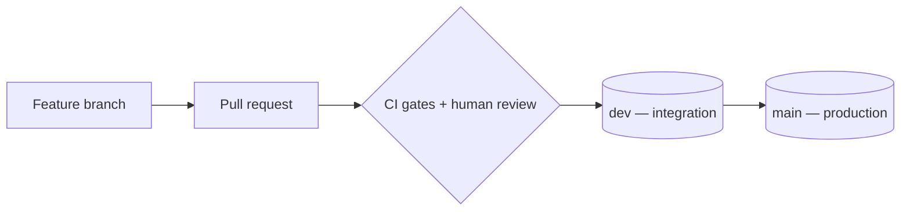

# Contributing

Thank you for considering a contribution. This repository is a starter template for agentic
development with Claude Code: an AI agent writes most of the code, and a system of
deterministic gates keeps every change inside the bounds the project defines. Contributions
follow the same rules the template enforces on its own code. You do not need Claude Code to
contribute — every gate is a plain npm script you can run yourself.

## Prerequisites

- **Node.js 24 LTS**, the version pinned in [`.nvmrc`](.nvmrc). Run `nvm use` (or the
  equivalent for your version manager) before working; some gates rely on Node 24 and fail
  spuriously on older releases.
- **npm**, the package manager of record. pnpm, yarn, and bun are not used.
- **Docker**, required by the local Supabase stack when your change touches data access or
  migrations.
- **git** and a GitHub account, to open a pull request.

Install dependencies from the lockfile and confirm the toolchain is healthy:

```bash
npm ci
npm run typecheck && npm run lint
```

The full setup, including the orchestrated dev server, is described in the
[README](README.md#getting-started).

## The core principle: decisions first

Every architectural decision is recorded as an Architecture Decision Record (ADR) before any
code depends on it. When your change needs a decision that no existing ADR covers — a new
dependency, a new pattern, or a departure from a recorded rule — record the decision first,
then write the code.

- Record an architectural choice as a new ADR under [`docs/decisions/`](docs/decisions/) in
  the MADR full-template format. The `adr` skill scaffolds one with the correct number.
- Record an externally fixed, client-mandated choice as a `CON-00x` row in
  [`docs/decisions/constraints.md`](docs/decisions/constraints.md). Editing that registry is a
  human-only action.
- Leave the `proposed → accepted` transition to a human; an agent never sets an ADR to
  `accepted`, and an accepted ADR changes only through a new superseding record.

[`CLAUDE.md`](CLAUDE.md) is generated from the accepted ADRs and is the authoritative summary
of the project's rules. Read it before making a substantial change.

## Change lifecycle

A change moves from a feature branch through a protected integration branch to production.
Every pull request requires human approval; advisory AI review may comment, but it never
replaces a human reviewer and never acts as a blocking check.



1. Branch from `dev`, the integration branch.
2. Make your change, following the conventions in `CLAUDE.md`.
3. Run the gates locally until they pass (see below).
4. Open a pull request into `dev`; `main` is reserved for production promotion.
5. Address review feedback. A human approval is mandatory before merge.

Merging into `dev` and `main`, production promotion, branch-protection settings, accepting
ADRs, and rotating secrets are human-only actions.

## Commit messages

Commits follow [Conventional Commits](https://www.conventionalcommits.org/), enforced by
commitlint. The machine-readable history feeds the changelog draft at each release.

```
feat(auth): add email/password sign-in
fix(ci): pin the gitleaks action to a commit SHA
docs: clarify the environment-sync decision point
```

Use a standard type (`feat`, `fix`, `docs`, `chore`, `ci`, `refactor`, `test`, and the
like), an optional scope in parentheses, and a short subject in the imperative mood.

## Run the gates before opening a pull request

Green locally means green in CI, because the local gates and the CI gates run the same
`check:*` commands. Run the gates relevant to your change before you push, or run the common
ones together:

```bash
npm run typecheck      # types
npm run lint           # ESLint
npm run format:check   # Prettier
npm run test           # Vitest (unit + Storybook browser mode)
```

Design-system, internationalization, and architecture changes carry their own gates —
`check:tokens`, `check:fsd`, `check:boundaries`, `check:i18n`, and others — listed in the
[README commands](README.md#deterministic-gates) and run in
[`.github/workflows/ci.yml`](.github/workflows/ci.yml). If you use Claude Code, the
`pre-pr-gate` skill runs the full set for you.

Tests are colocated with the code they cover, and merged coverage must stay at or above 80%
to merge.

## Working with Claude Code

The template configures Claude Code for this repository, and that configuration is itself
part of the project:

- **Skills** under `.claude/skills/` encode ratified procedures, such as creating an ADR or
  scaffolding a component.
- **Subagents** under `.claude/agents/` review a diff before a pull request — for
  correctness, security, Row-Level Security, and ADR conformance.
- **Hooks** under `scripts/hooks/` run at edit time, blocking edits to protected files and
  running checks before a write rather than after it.

These help the agent stay within the rules, but they never replace the deterministic gates or
human review.

## Reporting bugs and security issues

Open a bug report as a GitHub issue with steps to reproduce. For security vulnerabilities,
follow [SECURITY.md](SECURITY.md) and report privately rather than in a public issue.
