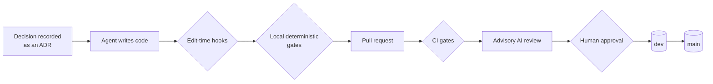

# claude-code-nextjs-starter

[](https://github.com/real-case/claude-code-nextjs-starter/actions/workflows/ci.yml)
[](LICENSE)
[](.nvmrc)
[](https://nextjs.org)
[](https://claude.com/claude-code)
[](https://github.com/real-case/claude-code-nextjs-starter/generate)

**Deterministic guardrails for agentic development.** A Next.js 16 + Supabase starter, wired end-to-end for Claude Code: ADR-governed decisions, machine-checkable gates, and edit-time hooks that keep a probabilistic AI agent inside the bounds the project defines.

A starter template for a Next.js application, pre-configured for agentic development with Claude Code. An AI agent writes most of the code; the human retains only the decisions a machine cannot make. The application backend is **Supabase** (Postgres + RLS + Auth).

The approach follows from the nature of the tool. An AI implementer is probabilistic (stochastic) by nature: it can produce correct code, but it does not guarantee it. The response is to surround the agent with deterministic tooling that holds it in bounds. That tooling is what this template assembles:

- a corpus of architecture decision records (ADRs);
- deterministic gates;
- edit-time hooks;
- code generation from a single source;
- Claude Code skills and review subagents;
- advisory AI jobs;
- an MCP toolchain.

Every layer follows the **decisions-first** principle — record the decision, then write the code — and the layers operate together as one rule system.

> **Key principle.** The automated checks form a system of rules and gates that keep the AI agent inside the bounds the project defines and prevent drift. Any single mistake must pass several independent machine checks before it can reach `main`. Text agreements drift over time; gates do not. So every rule here is **machine-checkable**, **generated from a single source**, and **provably self-enforcing**.

## How the guardrails fit together

A change moves through layers of control on its way to production. Each layer is independent, so a defect that slips past one is still caught by the next.



Edit-time hooks fire at the moment a file is written, so a violation is rejected before it is even saved rather than after the fact in CI. The local gates and CI gates run the same deterministic `check:*` checks and code-generation drift checks. Advisory AI review is a consultative layer on top of the deterministic gates; it never acts as a blocking check. Human approval is mandatory on every pull request, and `main` always stays deployable.

## Stack

The stack is grouped into the application's technical foundation and the layer of testing, machine gates, CI, and hosting.

### Application stack

| Layer                | Technologies                                                                                                                  |
| -------------------- | ----------------------------------------------------------------------------------------------------------------------------- |
| Framework and UI     | Next.js 16 (App Router, React Server Components by default), React 19, React Compiler (automatic memoization)                 |
| Language and runtime | TypeScript (`strict` + `noUncheckedIndexedAccess` + `noImplicitOverride`), Node.js 24 LTS, npm                                |
| Backend and data     | Supabase — Postgres + RLS + Auth; access through `@supabase/ssr`, Supabase CLI migrations, DB types generated from the schema |
| Validation and forms | Zod (the single validation authority), React Hook Form + `zodResolver`, Zod-validated env behind a `server-only` fence        |
| State                | TanStack Query (server state), Zustand (ephemeral UI state), nuqs + typed routes (URL state)                                  |
| Styling and tokens   | Tailwind CSS (CSS-first), design tokens through `@theme`, shadcn/ui                                                           |
| i18n and SEO         | next-intl, App Router Metadata API (sitemap / robots)                                                                         |
| Observability        | Structured JSON logger to stdout, App Router error boundaries                                                                 |

### Testing, machine gates, CI, and hosting

| Layer          | Technologies                                                                                                                                                                                        |
| -------------- | --------------------------------------------------------------------------------------------------------------------------------------------------------------------------------------------------- |
| Testing        | Vitest + React Testing Library, Playwright (e2e), Storybook 10 (stories double as tests), addon-a11y / axe (WCAG 2.2 AA), Chromatic (visual regression)                                             |
| Machine gates  | ESLint (flat config) + Prettier, dependency-cruiser, Steiger (Feature-Sliced Design boundaries), commitlint, cspell, gitleaks, CodeQL, `npm audit`; the `check:*` gates and `gen:*` code generation |
| Hosting and CI | Vercel (a preview deploy per pull request, plus production), GitHub Actions                                                                                                                         |

## AI infrastructure

The AI infrastructure is the core of the template. It lives under `.claude/` and `scripts/`, and breaks down into the following components.

| Component                              | Contents                                                                                                                                                                                                                                                                                                                                            | Role                                                                                                                    |
| -------------------------------------- | --------------------------------------------------------------------------------------------------------------------------------------------------------------------------------------------------------------------------------------------------------------------------------------------------------------------------------------------------- | ----------------------------------------------------------------------------------------------------------------------- |
| Claude Code configuration (`.claude/`) | `CLAUDE.md`, the agent's standing instruction generated from the accepted ADRs; the skills, subagents, commands, and hooks detailed below                                                                                                                                                                                                           | The environment in which the agent works strictly by the project's rules                                                |
| Skills                                 | ADR cycle: `adr`, `adr-accept`, `adr-audit`, `adr-coverage`, `adr-supersede`, `adr-sync-claude-md`. Design system: `new-component`, `component-signature`, `check-tokens`, `state-coverage`, `story-matrix`, `story-verify`. Workflow: `new-slice`, `create-migration`, `add-translation`, `git-commit`, `pre-pr-gate`, `debt-scan`, `claude-audit` | Ratified procedures for recurring operations, so the agent follows a fixed playbook rather than improvising             |
| Subagents (`.claude/agents/`)          | Review: `code-reviewer`, `security-reviewer`, `supabase-rls-reviewer`, `storybook-reviewer`, `adr-conformance-reviewer`, `adr-drift-auditor`. Research: `docs-researcher`                                                                                                                                                                           | Isolated, narrowly scoped checks of a diff and documentation lookups before a pull request is opened                    |
| Edit-time hooks (`scripts/hooks/`)     | `PreToolUse` and `PostToolUse` hooks (`guard-protected-files.mjs`, `post-edit-checks.mjs`)                                                                                                                                                                                                                                                          | Run at the moment of an edit: they block edits to protected files and run checks before the write, not after            |
| MCP toolchain (`.mcp.json`)            | context7 (documentation), figma (read-only design context), vercel, supabase, chromatic, github                                                                                                                                                                                                                                                     | The agent's access to external systems through official, version-pinned servers with least-privilege tokens             |
| Advisory AI jobs (`scripts/ai/`)       | PR review (`pr-review`), CI-failure triage (`ci-triage`), changelog draft (`changelog`), second-layer security review (`security-review`); a provider-agnostic, OpenAI-compatible client                                                                                                                                                            | An advisory layer over the deterministic gates; inert until a human provisions `AI_API_KEY`, and never a blocking check |

## Architectural decisions

Every architectural decision is recorded as an ADR before any code depends on it. The records live under [`docs/decisions/`](docs/decisions/) in the MADR full-template format, with permanent zero-padded numbers.

The lifecycle is `proposed → accepted`. A record is edited freely while `proposed`; once `accepted`, it changes only through a new superseding record. The `proposed → accepted` transition is human-confirmed — an agent never sets `accepted`. Externally fixed, client-mandated choices are recorded as `CON-00x` rows in [`docs/decisions/constraints.md`](docs/decisions/constraints.md) rather than as ADRs. [`CLAUDE.md`](CLAUDE.md) is generated from the accepted ADRs and is the agent's standing instruction.

## Repository layout

| Path              | Contents                                                                                                                                                                                                                                                                                                             |
| ----------------- | -------------------------------------------------------------------------------------------------------------------------------------------------------------------------------------------------------------------------------------------------------------------------------------------------------------------- |
| `src/`            | Application source. Feature code is organized by Feature-Sliced Design (`shared`, `entities`, `features`, `widgets`), alongside `app/` (App Router routes), `components/` (the shadcn ui kit), `design-system/` (controlled vocabularies and generated tokens), `lib/` (env, Supabase clients, logger), and `i18n/`. |
| `docs/decisions/` | The ADR corpus (MADR) and the `constraints.md` registry.                                                                                                                                                                                                                                                             |
| `docs/`           | The overview document set (`01`–`03`) and the design-system process docs (`docs/design-system/`).                                                                                                                                                                                                                    |
| `.claude/`        | Claude Code configuration: `skills/`, `agents/` (subagents), and `commands/`.                                                                                                                                                                                                                                        |
| `scripts/`        | Gate scripts, the dev orchestrator, `hooks/` (edit-time), and `ai/` (advisory jobs).                                                                                                                                                                                                                                 |
| `supabase/`       | Plain-SQL migrations, including RLS policies.                                                                                                                                                                                                                                                                        |
| `messages/`       | next-intl translation catalogs.                                                                                                                                                                                                                                                                                      |
| `.github/`        | GitHub Actions CI workflows.                                                                                                                                                                                                                                                                                         |

## Getting started

### Prerequisites

- **Node.js 24 LTS.** The version is pinned in [`.nvmrc`](.nvmrc); the `engines` field requires `>=24 <25`.
- **npm**, the package manager of record. pnpm, yarn, and bun are not used.
- **Docker**, required by the local Supabase stack.

### Setup

1. Install dependencies from the lockfile:

   ```bash
   npm ci
   ```

2. Create a local environment file from the example and fill in the values:

   ```bash
   cp .env.example .env
   ```

3. Start the development environment:

   ```bash
   npm run dev
   ```

   `npm run dev` is an orchestrated startup: it brings up the local Supabase stack, regenerates the database types, runs the environment-sync step, and hands off to `next dev`, served at `http://localhost:3000`. Environment sync ships as a decision point — a `TODO(you)` in [`scripts/dev.mjs`](scripts/dev.mjs) where you implement the `vercel env pull` policy for your setup; until then the app runs on the local defaults in [`src/lib/env.ts`](src/lib/env.ts).

## Commands

### Development and build

| Command         | Description                                                                    |
| --------------- | ------------------------------------------------------------------------------ |
| `npm run dev`   | Orchestrated startup: Supabase up, type generation, env sync, then `next dev`. |
| `npm run build` | Production build (`next build`).                                               |
| `npm run start` | Serve the production build.                                                    |

### Quality and formatting

| Command                | Description                       |
| ---------------------- | --------------------------------- |
| `npm run typecheck`    | Type-check with `tsc --noEmit`.   |
| `npm run lint`         | ESLint (flat config).             |
| `npm run format`       | Format the tree with Prettier.    |
| `npm run format:check` | Check formatting without writing. |

### Tests

| Command                  | Description                                                       |
| ------------------------ | ----------------------------------------------------------------- |
| `npm run test`           | Vitest across all projects (unit jsdom + Storybook browser mode). |
| `npm run test:unit`      | Vitest, the unit project only (fast jsdom loop).                  |
| `npm run test:watch`     | Vitest in watch mode.                                             |
| `npm run test:coverage`  | Merged-workspace coverage run; fails below 80%.                   |
| `npm run test:e2e`       | Playwright end-to-end tests.                                      |
| `npm run test:storybook` | Storybook test-runner build-integrity smoke.                      |

### Storybook and visual regression

| Command                   | Description                                       |
| ------------------------- | ------------------------------------------------- |
| `npm run storybook`       | Storybook dev server on port 6006.                |
| `npm run build-storybook` | Static Storybook build.                           |
| `npm run chromatic`       | Chromatic visual regression over changed stories. |

### Deterministic gates

| Command                       | Description                                                            |
| ----------------------------- | ---------------------------------------------------------------------- |
| `npm run check:stories`       | Every `src/components/**` module has colocated stories.                |
| `npm run check:tokens`        | Design-token usage lint over `src/components/**`.                      |
| `npm run check:boundaries`    | dependency-cruiser module-boundary gate.                               |
| `npm run check:fsd`           | Steiger Feature-Sliced Design boundary gate.                           |
| `npm run check:graph`         | Composition ↔ import-graph reconciliation.                             |
| `npm run check:design-intent` | `design-intent.ts` fitness functions.                                  |
| `npm run check:seals`         | Figma drift-seal gate (inert until a Figma project exists).            |
| `npm run check:i18n`          | Translation key parity and ICU validation.                             |
| `npm run check:design-system` | Run the design-system gate bundle.                                     |
| `npm run check:gates`         | Gate self-test — each custom rule must reject its own violator.        |
| `npm run check:claude`        | Claude-infra integrity (skill, agent, and command cross-references).   |
| `npm run check:claude-md`     | `CLAUDE.md` ↔ accepted-ADR citation reconciliation.                    |
| `npm run check:citations`     | ADR citation integrity.                                                |
| `npm run check:action-pins`   | GitHub Actions are pinned to commit SHAs.                              |
| `npm run check:licenses`      | Dependency license check.                                              |
| `npm run check:spelling`      | cspell over Markdown files.                                            |
| `npm run check:audit`         | `npm audit` at the high level over production dependencies.            |
| `npm run check:commits`       | commitlint over a commit range.                                        |
| `npm run check:debt`          | Inventory of ADR-sanctioned escape hatches used without justification. |

### Design-system helpers

These are advisory; run them while building a component.

| Command                   | Description                                                        |
| ------------------------- | ------------------------------------------------------------------ |
| `npm run ds:signature`    | Composition-signature duplicate check before creating a component. |
| `npm run ds:states`       | The mandatory state set for an archetype.                          |
| `npm run ds:escalations`  | The escalation surfacer for role collisions and state deviations.  |
| `npm run ds:tokens-table` | The end-of-wave token-consistency table.                           |

### Database and code generation

| Command              | Description                                                                |
| -------------------- | -------------------------------------------------------------------------- |
| `npm run db:reset`   | Rebuild the local database from the `supabase/` migrations.                |
| `npm run gen:types`  | Regenerate `src/lib/supabase/database.types.ts`; CI fails on drift.        |
| `npm run gen:tokens` | Regenerate the token union, lint allowlist, and agent rules from `@theme`. |

## Project status

The template ships clean. It contains no demonstration application, and `src/components/**` is empty, so the design-system governance gates have nothing to act on yet. They activate automatically on the first component that is added — the infrastructure does not need to be completed, it is ready to be filled with product code. A demonstration of development with this template will be built in a separate repository.

A few files ship as deliberate decision points rather than finished code. Each is marked with a `TODO(you)` comment and cites the ADR that frames the choice, because the right answer depends on your project rather than on the template:

- the log-classification policy in [`src/lib/logger.ts`](src/lib/logger.ts) (ADR 0019);
- the query-key factory in [`src/lib/query/keys.ts`](src/lib/query/keys.ts) (ADR 0025);
- the environment-sync policy in [`scripts/dev.mjs`](scripts/dev.mjs) (ADR 0023);
- the composition-signature amplifier in [`scripts/component-signature.mjs`](scripts/component-signature.mjs) (ADR 0059).

The template runs without them, so fill each one when you reach the decision it represents.

## Documentation

These are the authoritative sources, all of which live in the repository:

- [`CLAUDE.md`](CLAUDE.md) — the agent's standing instruction, generated from the accepted ADRs.
- [`docs/decisions/`](docs/decisions/) — the ADR corpus (MADR format) and the constraints registry.
- [`docs/design-system/`](docs/design-system/) — the design-system governance process docs (the Defect Log and the migration procedures).
- [`docs/deviations.md`](docs/deviations.md) — the deviation journal: temporary, on-the-record departures from an accepted ADR during bootstrap.

A companion overview set goes deeper, with three documents that build on one another:

| #   | Document                                                      | Subject                                                                           | Type        |
| --- | ------------------------------------------------------------- | --------------------------------------------------------------------------------- | ----------- |
| 01  | [Problems and advantages](docs/01-problems-and-advantages.md) | The problems the approach solves and the advantages that follow                   | Explanation |
| 02  | [Defense mechanisms](docs/02-defense-mechanisms.md)           | The control mechanisms: hooks, deterministic gates, code generation, CI           | Reference   |
| 03  | [Methodology](docs/03-methodology.md)                         | How work is carried out: the ADR lifecycle, human and agent roles, feedback loops | Explanation |

## License

Released under the [MIT License](LICENSE), © 2026 Yurii Anichkin.
