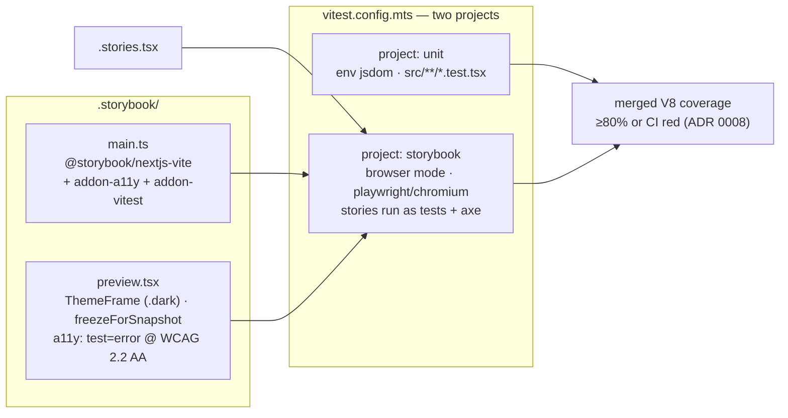
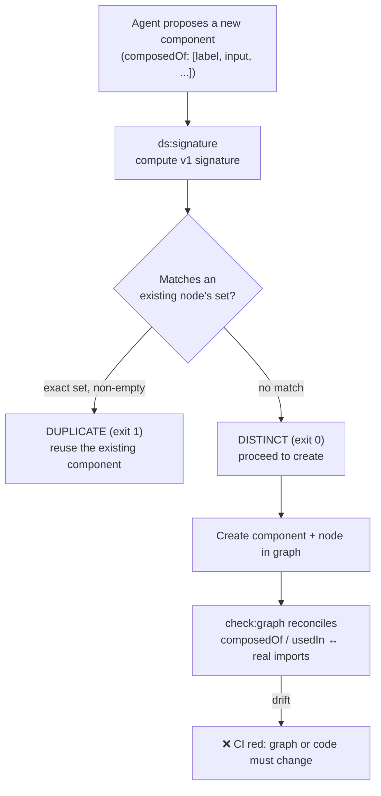
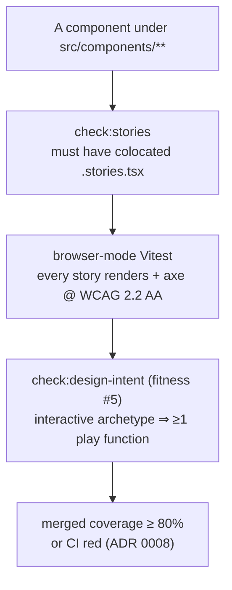
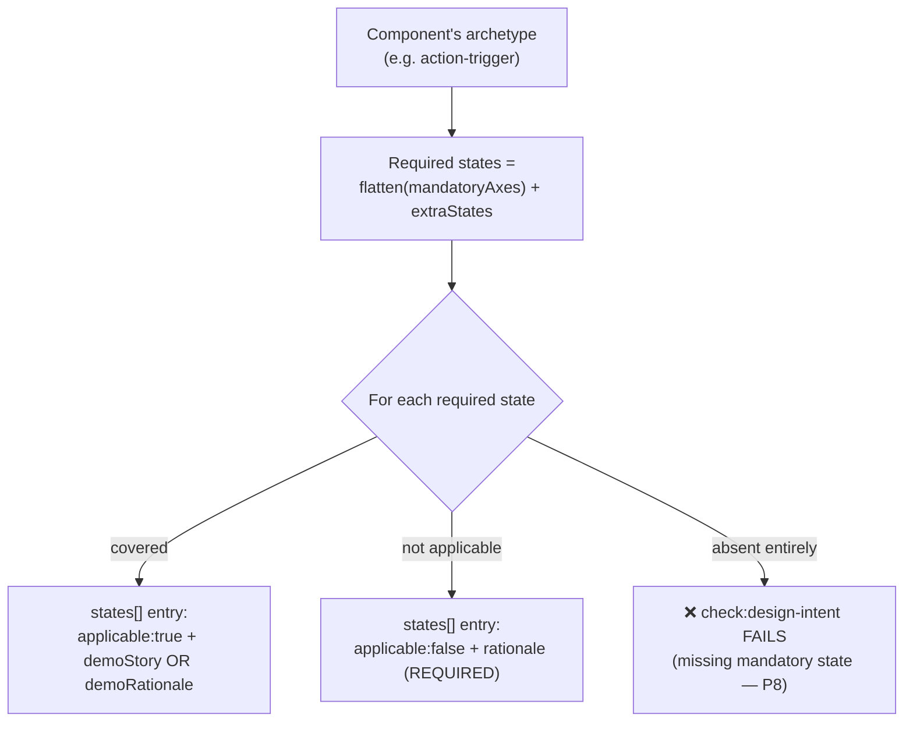
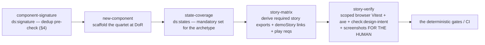

# Storybook & Component-Quality Guardrails

> How the architecture mechanically enforces four properties for every UI component:
> **token-only styling**, **no structural duplication**, **complete testing**, and
> **full UI-state coverage** — with stories as the test substrate, not just docs.

This is the component-layer companion to
[`AI-GUARDRAILS.md`](AI-GUARDRAILS.md). That document covers the project-wide
deterministic governance (hooks, single-source codegen, CI, the three-layer model);
this one zooms into how those same mechanisms make Storybook the enforcement surface
for component quality. Where a mechanism is shared, this document links rather than
repeats.

The four guarantees, and the gate that proves each:

| Guarantee                     | Primary gate                                    | ADR                 |
| ----------------------------- | ----------------------------------------------- | ------------------- |
| **Token-only styling**        | `check:tokens` (ESLint) + `gen:tokens` drift    | 0058                |
| **No structural duplication** | `ds:signature` + `check:graph`                  | 0059 / 0060         |
| **Complete testing**          | `check:stories` + browser-mode Vitest + axe     | 0037/0039/0041/0042 |
| **Full UI-state coverage**    | `check:design-intent` (coverage by subtraction) | 0061 / 0062         |

---

## 1. The unit of governance — the component quartet

Component quality isn't enforced on a single file; it's enforced on a **quartet** of
co-located artifacts that must stay mutually consistent. Three deterministic gates
reconcile them against each other and against reality.

```mermaid
flowchart TD
    subgraph quartet["The component quartet (src/components/ui/<id>.*)"]
        impl["<id>.tsx\nimplementation (cva variants, slots)"]
        intent["<id>.design-intent.ts\nthe SPEC — API, states, archetype"]
        stories["<id>.stories.tsx\nCSF 3 stories = browser tests"]
    end
    graph["composition-graph.json\nnode: kind · archetype · composedOf · usedIn"]
    registry["src/design-system/\nstates.ts · archetypes.ts · usage-roles.ts"]

    intent -- "check:design-intent (api↔props)" --> impl
    intent -- "check:design-intent (states↔stories)" --> stories
    intent -- "check:design-intent (meta↔graph)" --> graph
    intent -- "states by subtraction" --> registry
    graph -- "check:graph (usedIn/composedOf ↔ imports)" --> impl
    stories -- "check:stories (existence)" --> impl
```

The `design-intent.ts` spec is the keystone: it is authored at Definition-of-Ready,
**before** implementation, and every other artifact is reconciled against it. The API is
_derived from the `usedIn` union_, never guessed; the states are _subtracted from the
archetype's mandatory set_, never listed from memory ([ADR 0062](docs/decisions/0062-design-intent-spec-and-api-derivation.md)).

---

## 2. Stories are tests, not docs — the execution architecture

The decision that makes everything else enforceable: **`@storybook/addon-vitest` turns
every story export into a browser-mode Vitest test case.** "Write a story" and "write a
test" are the same act. Coverage from stories merges with unit coverage into one ≥80%
gate ([ADR 0041](docs/decisions/0041-coverage-merge-across-vitest-projects.md)).



What each story export gets, automatically:

- **Render-without-throw** smoke (the story renders).
- **`play` function execution** — user interactions run for real ([ADR 0038](docs/decisions/0038-interaction-testing-play-functions.md)).
- **axe accessibility scan** at WCAG 2.2 AA, `test: "error"` — any violation fails the
  story ([ADR 0039](docs/decisions/0039-accessibility-testing-gate-a11y-axe.md)).
- **Coverage contribution** to the merged gate.

Determinism is pinned in `preview.tsx`: `freezeForSnapshot` zeroes animations,
transitions, and caret blinking _only_ under `isChromatic()`, so a visual diff means a
real change ([ADR 0043](docs/decisions/0043-visual-regression-chromatic.md)). The
`test-runner.ts` smoke engine deliberately contributes **no coverage and no axe** —
those are single-sourced from the Vitest projects, never duplicated
([ADR 0037](docs/decisions/0037-story-test-execution-engines.md)).

A separate concern from _authoring_ rules: CSF 2 (`Template.bind({})`), `storiesOf`, and
MDX-defined stories **fail lint** — only CSF 3 is legal
([ADR 0036](docs/decisions/0036-story-authoring-csf3.md)).

---

## 3. Guarantee ① — token-only styling

Components and their stories may use **only** semantic design tokens; raw values are
mechanically rejected. The full single-source codegen story (CSS `@theme` → typed union

- lint allowlist + agent-rules reference, drift-checked in CI) is documented in
  [`AI-GUARDRAILS.md` §7](AI-GUARDRAILS.md). The component-facing surface:

`check:tokens` is `eslint src/components` ([ADR 0058](docs/decisions/0058-token-usage-enforcement-and-codegen.md)). In `src/components/**` it rejects:

- raw hex / `rgb()` / `hsl()` / named colors
- raw values in inline `style={{ }}` props
- raw SVG `fill` / `stroke`
- Tailwind's **numbered palette** (`bg-blue-500`) — only the semantic token utilities
  (the shadcn-bridged names like `bg-primary` / `text-muted-foreground`, and any tokens a
  design-system export adds) are allowed

```
   ┌── globals.css @theme ──┐  single source
   │                        │
   ▼            ▼            ▼
tokens.       tokens.     tokens.agent-rules.md
generated.ts  allowlist     (what the agent reads)
   │          .json
   │            │
   │            ▼
   │    ESLint allowlist ── check:tokens ──► CI block
   │            ▲
   └── same list ┘   (agent rules == lint rules: no "knowledge laundering")
```

This fires at **three ranges**: the PostToolUse hook runs scoped ESLint on the file the
agent just wrote (blocks at the keystroke), `check:tokens` runs locally and in CI, and
`gen:tokens` drift-checks the generated artifacts. A raw color has to evade all three.

---

## 4. Guarantee ② — no structural duplication

Before a component is created, its **composition signature** is checked against the
graph so the agent reuses an existing component instead of cloning its structure
([ADR 0059](docs/decisions/0059-component-composition-dependency-graph.md), problem P2).

**Signature v1** = the normalized _set_ of composed primitive ids (sorted, de-duplicated;
no topology — subtree isomorphism is deferred until the Defect Log proves it necessary):

```js
const signatureOf = (composedOf) => [...new Set(composedOf)].sort();

// classifyCandidate(proposed, existing):
//   sameSet && non-empty  → "duplicate"  → exit 1: REUSE, don't create
//   otherwise             → "distinct"   → exit 0: clear to create
```



The structural (warn-level) helper `ds:signature` runs _while the agent is deciding_;
the deterministic backstop is `check:graph`, which fails CI if the hand-maintained
composition graph's `composedOf`/`usedIn` edges drift from the real
dependency-cruiser import graph ([ADR 0060](docs/decisions/0060-module-boundary-dependency-cruiser.md)). Every module under `src/components/ui/` **must** appear as a graph node, so a new component can't hide from the dedup check.

---

## 5. Guarantee ③ — complete testing

"Complete" decomposes into three mechanical sub-rules, none trusting the others:



1. **Existence** — `check:stories` (`check-component-stories.mjs`) requires every
   non-test, non-story `.tsx` under `src/components/**` to have a colocated
   `<name>.stories.tsx` sibling ([ADR 0042](docs/decisions/0042-component-story-coverage-policy.md)).
2. **Execution + a11y** — each story runs as a browser test with an axe gate (§2).
3. **Interaction** — `check:design-intent` derives the set of _interactive_ archetypes
   (those whose mandatory axes include `interaction`) and fails if such a component's
   stories have no `play` function (`/\bplay\s*:/`), graduated from the Defect Log as
   DL-005 ([ADR 0038](docs/decisions/0038-interaction-testing-play-functions.md)).
4. **Coverage** — story + unit coverage merge into the ≥80% gate; `hotfix` PRs may
   bypass the _threshold_ only, never the rest ([ADR 0008](docs/decisions/0008-test-coverage-threshold-gate.md)).

Purely **presentational** components (graph `archetype: null`, e.g. `label`) are exempt
from the play-function requirement — the exemption is recorded in the graph node, not
assumed ([ADR 0042](docs/decisions/0042-component-story-coverage-policy.md)).

What stays **human judgment**: whether the stories demo _meaningful_ states is reviewed
by a person; the gate guarantees existence + execution + state-contract consistency, not
taste.

---

## 6. Guarantee ④ — full UI-state coverage

This is the crown jewel: how the architecture knows a component demos _every_ UI state
it should, rather than the happy path the agent happened to think of. Two ideas combine:
a **ratified state registry** and **coverage by subtraction**.

### 6.1 The state registry — the source of "all possible states"

`src/design-system/states.ts` defines state **axes** and the mandatory axes per
**archetype** (human-authored controlled vocabularies,
[ADR 0061](docs/decisions/0061-controlled-vocabularies-and-state-registries.md)):

```ts
export const STATE_AXES = {
  data:          ["empty", "single", "many", "overflow", "error-fetch"],
  interaction:   ["default", "hover", "focus-visible", "active", "disabled", "read-only"],
  process:       ["idle", "loading", "success", "error-action", "retry"],
  validation:    ["pristine", "valid", "invalid", "warning"],
  contentBounds: ["min-content", "max-content", "line-wrap", "truncation", "cjk", "rtl"],
};

// archetype → which axes are MANDATORY (the acceptance-criteria source)
ARCHETYPE_STATES["action-trigger"] = { mandatoryAxes: ["interaction", "contentBounds"], ... };
ARCHETYPE_STATES["text-input"]     = { mandatoryAxes: ["interaction", "validation", "contentBounds"], ... };
ARCHETYPE_STATES["collection"]     = { mandatoryAxes: ["data", "process", "interaction", "contentBounds"], ... };
```

The 10 archetypes (`action-trigger`, `text-input`, `selection-control`,
`categorical-indicator`, `collection`, `container`, `feedback`, `navigation`, `media`,
`disclosure`) each pin a mandatory state set. When two states co-occur, the
**state-precedence matrix** resolves which wins, once and for all (`focus-visible`
always visible; `disabled` suppresses hover/active; `loading` keeps its own affordance).

### 6.2 Coverage by subtraction — silence is a failure

You do **not** list the states you handled (easy to under-count). You start from the
archetype's _full_ mandatory set and must account for **every** one — either demo it or
explicitly mark `applicable: false` **with a rationale**.



`check:design-intent` (fitness #3):

```js
const required = [
  ...spec.mandatoryAxes.flatMap((a) => STATE_AXES[a]),
  ...(spec.extraStates ?? []),
];
for (const stateName of required)
  if (!declaredStates.has(stateName))
    fail(
      id,
      `missing mandatory state "${stateName}" for archetype "${node.archetype}"
              — cover it or mark applicable:false + rationale.`,
    );
```

A skipped state is not a silent pass — it is a CI failure until a human records _why_ it
doesn't apply. (Example: a native `<button>` has no `read-only` state → `applicable:false`,
rationale recorded.)

### 6.3 The states ↔ stories contract — both directions

Declaring a state isn't enough; the spec and the stories must agree. `check:design-intent`
(fitness #4) enforces a bidirectional contract:

| Rule                                                                               | Failure (Defect-Log id)                      |
| ---------------------------------------------------------------------------------- | -------------------------------------------- |
| An `applicable:true` state needs **exactly one** of `demoStory` or `demoRationale` | silent gap / both = contradiction (ADR 0062) |
| A `demoStory` must be a **real export** of `<id>.stories.tsx`                      | stale-link fail                              |
| A story tagged `state:X` must reference a **declared** state                       | contract-expansion fail                      |

```
   design-intent.states[]                 <id>.stories.tsx
   ┌──────────────────────┐               ┌──────────────────────┐
   │ name: "disabled"     │── demoStory ─►│ export const Disabled │
   │ applicable: true     │◄── state:X ───│ tags: ["state:disabled"]
   │ demoStory: "Disabled"│   tag must     └──────────────────────┘
   └──────────────────────┘   be declared
```

Transient states that _cannot_ be pinned in a static story (`hover`, `focus-visible`,
`active`) use `demoRationale` instead of `demoStory` — they stay `applicable:true`, with
their tokens recorded for manual/visual verification, but are honestly marked as not
statically demoable.

---

## 7. Worked example — a Button (`action-trigger`) quartet

> **Illustrative.** This template ships **zero components** — the `button` quartet below
> is a worked example of how the gates force complete coverage for a canonical
> `action-trigger`, i.e. the shape your first component follows. Nothing here is shipped.

A `button` is `archetype: "action-trigger"` → mandatory axes `interaction` +
`contentBounds`. Tracing how the gates force complete coverage:

`button.design-intent.ts` (excerpt) — every required state accounted for:

```ts
states: [
  // interaction (mandatory)
  { name: "default", applicable: true, demoStory: "Default" },
  {
    name: "hover",
    applicable: true,
    demoRationale: "Transient pointer state — :hover cannot be pinned",
  },
  {
    name: "focus-visible",
    applicable: true,
    demoRationale: "...",
    tokens: ["--color-ring"],
  },
  {
    name: "active",
    applicable: true,
    demoRationale: "Transient pressed state",
  },
  { name: "disabled", applicable: true, demoStory: "Disabled" },
  {
    name: "read-only",
    applicable: false,
    rationale: "A native <button> has no read-only state",
  },
  // contentBounds (mandatory)
  { name: "min-content", applicable: true, demoStory: "IconOnly" },
  {
    name: "max-content",
    applicable: true,
    demoStory: "LongLabel",
    worstCaseForOverflow: true,
  },
  {
    name: "line-wrap",
    applicable: false,
    rationale: "Labels are whitespace-nowrap by design",
  },
  {
    name: "truncation",
    applicable: false,
    rationale: "No clipping affordance exists",
  },
  {
    name: "cjk",
    applicable: true,
    demoRationale: "Flows through the same nowrap path",
  },
  {
    name: "rtl",
    applicable: true,
    demoRationale: "Label is plain inline text",
  },
];
```

`button.stories.tsx` (excerpt) — the `demoStory` links resolve, the play function
satisfies the interaction requirement, tokens-only throughout:

```tsx
export const Default: Story = {};
export const Disabled: Story = { args: { disabled: true } };
export const IconOnly: Story = { args: { size: "icon", "aria-label": "Add item", children: <span aria-hidden>+</span> } };
export const LongLabel: Story = { args: { children: "Confirm subscription and continue…" }, decorators: [/* w-56 */] };
export const Dark: Story = { globals: { theme: "dark" }, render: /* variants under .dark */ };

export const Clickable: Story = {                       // satisfies ADR 0038 (interactive ⇒ play)
  play: async ({ args, canvasElement }) => {
    const button = within(canvasElement).getByRole("button", { name: "Save" });
    await userEvent.click(button);
    await expect(args.onClick).toHaveBeenCalledTimes(1);
  },
};
```

What would turn the PR red: dropping the `IconOnly` story (missing `min-content`
demoStory → stale-link fail), omitting `read-only` entirely (missing-mandatory-state
fail), using `bg-blue-600` anywhere (`check:tokens`), removing the play function
(`check:design-intent` #5), or adding a `<Button variant="huge">` not in the cva axis
(api↔props fail).

---

## 8. The authoring workflow — structural helpers in the loop

The deterministic gates above are the backstop. To keep the agent _inside_ the rails
while authoring, structural (warn-level) skills run first ([ADR 0051](docs/decisions/0051-ai-drafted-story-matrices-and-play-functions.md)):



- **`ds:states`** prints the archetype's mandatory axes so coverage starts from the full
  set, not memory.
- **`story-matrix`** derives _which_ story exports must exist (Default, Dark,
  Variants/Overview, data-edge, one per `applicable:true` state) and which play
  functions the archetype requires — but never invents a state; meaningfulness stays
  human (ADR 0042/0051).
- **`story-verify`** runs the scoped `vitest --project=storybook`, the scoped
  `check:design-intent --component <id>`, and collects screenshots **for a human to
  judge** — the agent never approves its own visuals.

---

## 9. Visual regression — Chromatic (human-gated)

`.github/workflows/chromatic.yml` publishes the static Storybook build and snapshots
**only changed stories** (TurboSnap, `onlyChanged: true`). The job is inert until a
human provisions `CHROMATIC_PROJECT_TOKEN` and stays `exitZeroOnChanges: true` — a visual
change surfaces in the Chromatic UI, it doesn't redden CI by itself.

**Baseline approval is human-only** ([ADR 0043](docs/decisions/0043-visual-regression-chromatic.md)/[0047](docs/decisions/0047-human-review-of-agent-authored-prs.md)): PNG baselines live off-repo in Chromatic, never in git, and the agent **never approves its own visual baseline** — the anti-hallucination principle from [`AI-GUARDRAILS.md` §11](AI-GUARDRAILS.md) applied to pixels.

---

## 10. Where each rule fires + mechanism → ADR index

| Rule                                 | Edit-time hook        | Local / CI gate                    | Human            | ADR       |
| ------------------------------------ | --------------------- | ---------------------------------- | ---------------- | --------- |
| Token-only styling                   | scoped ESLint         | `check:tokens`, `gen:tokens` drift | —                | 0058      |
| CSF 3 only (no CSF2/storiesOf/MDX)   | —                     | `lint`                             | —                | 0036      |
| Every component has stories          | —                     | `check:stories`                    | —                | 0042      |
| Stories run as browser tests         | —                     | `test` / `test:coverage`           | —                | 0037/0041 |
| axe @ WCAG 2.2 AA per story          | —                     | `test` (a11y test=error)           | opt-out reviewed | 0039      |
| Interactive ⇒ play function          | scoped nudge          | `check:design-intent` #5           | —                | 0038      |
| No structural duplicate              | `ds:signature` (warn) | `check:graph`                      | —                | 0059/0060 |
| API ↔ props consistency              | scoped nudge          | `check:design-intent` #2           | —                | 0062      |
| Full state coverage (by subtraction) | scoped nudge          | `check:design-intent` #3           | rationale review | 0061/0062 |
| States ↔ stories contract            | scoped nudge          | `check:design-intent` #4           | —                | 0061/0062 |
| Snapshot baselines update            | PreToolUse block      | reviewed action                    | 👤               | 0040      |
| Visual baseline approval             | —                     | Chromatic status                   | 👤               | 0043/0047 |
| Meaningful-state judgment            | —                     | —                                  | 👤               | 0042      |

---

_This document is descriptive — the authoritative rules are the accepted ADRs under
[`docs/decisions/`](docs/decisions/) and the scripts they mandate
(`scripts/check-_.mjs`, `src/design-system/states.ts`). Where this document and an
accepted ADR disagree, the ADR wins.\*
