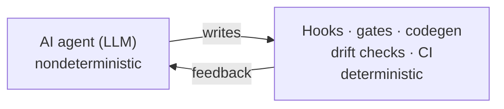
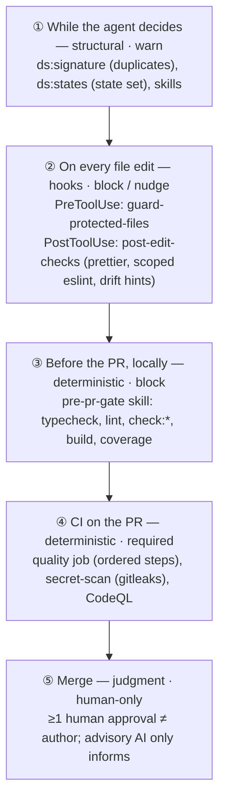
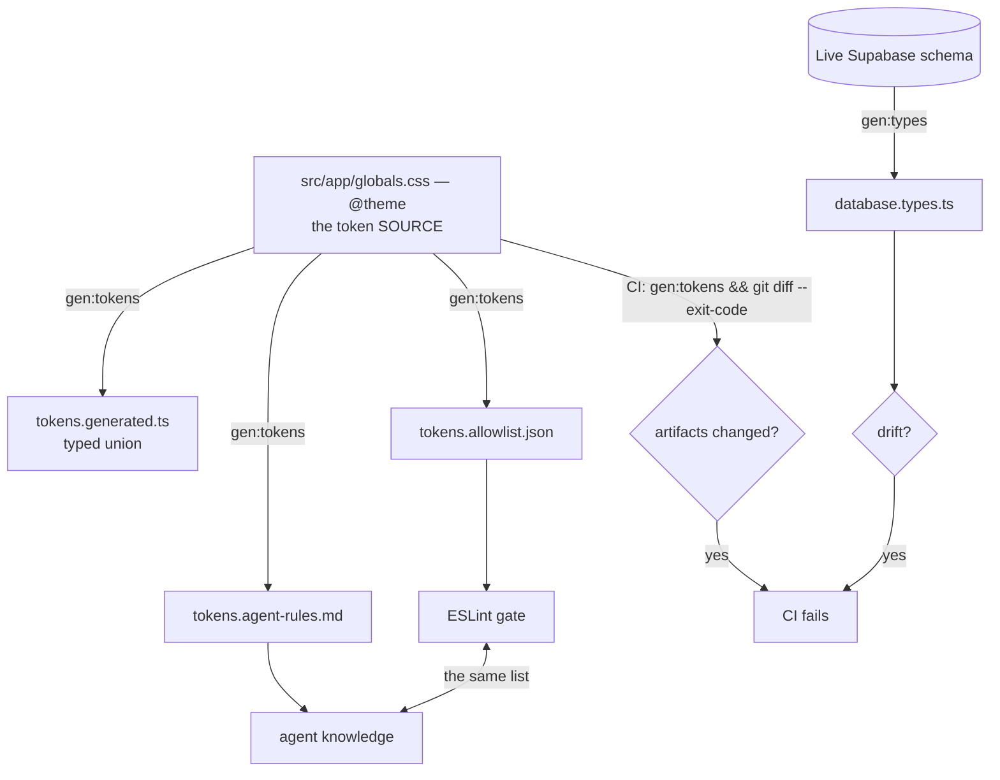
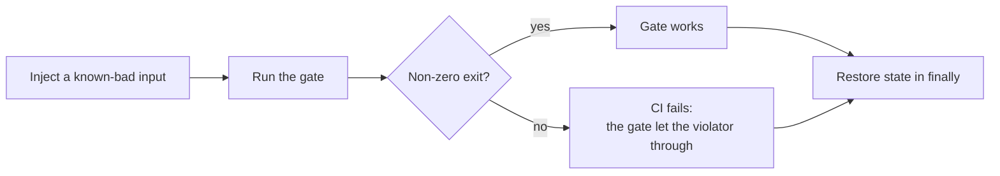

# Defense mechanisms

This document is a complete map of the control mechanisms in the template: the three-layer model, the timeline of when each fires, the edit-time hooks, the catalog of deterministic gates, code generation with drift checks, self-checking gates, the fitness functions, CI, and the human gates. Use it to look up what a given mechanism does, what it rejects, and which ADR it traces to.

The premise, from [01 — Problems and advantages](01-problems-and-advantages.md), is that an AI is a probabilistic implementer. The defense is not to make the model error-free but to **surround it with deterministic checkers** so that any single mistake must survive _several independent machine checks_ before it reaches `main`.

Each deterministic mechanism reads the real files, checks an invariant, and reports an error when it is violated.

## The three-layer model

Every rule belongs to exactly **one** layer, chosen by the _kind_ of guarantee it provides.

| Layer         | Guarantee                                                    | Failure mode          | Where it lives                                                      | ADR        |
| ------------- | ------------------------------------------------------------ | --------------------- | ------------------------------------------------------------------- | ---------- |
| Deterministic | _Precision_ — a passing gate confirms the property           | Blocks merge (CI red) | `check:*`, ESLint, `tsc`, coverage, `adr.py lint`, gitleaks, CodeQL | 0078       |
| Structural    | _Completeness_ — lowers the violation rate in the agent loop | Warns / hints         | `ds:*`, [`.claude/skills/*`](../.claude/skills), PostToolUse hints  | 0077       |
| Judgment      | An irreducible human decision                                | Requires a human      | The human-only action list (see below)                              | 0046, 0047 |

The layering is formalized by three meta-ADRs: hooks as the edit-time layer (0076), skills and review subagents as the structural layer (0077), and self-checking gates with a technical-debt escape hatch (0078).

## The timeline: where each mechanism fires

A single change passes up to **four** machine checkpoints before a human sees it, and **none trusts the previous one**. The checkpoints are ordered by distance from the moment code is written.

The key invariant is "green locally means green in CI": the same set of `check:*` runs in both `pre-pr-gate` and `ci.yml`.

## Edit-time hooks: the rampart closest to the edit

Hooks turn the _prose_ of `CLAUDE.md` into _mechanical_ enforcement at the moment the agent touches a file. They are configured in [`.claude/settings.json`](../.claude/settings.json).

### PreToolUse — guard-protected-files

[`scripts/hooks/guard-protected-files.mjs`](../scripts/hooks/guard-protected-files.mjs) fires on `Write`, `Edit`, `NotebookEdit`, and `Bash`. It exits with code `2` to block with a stated reason, or `0` to allow. On an unexpected error the hook is **fail-open**, because a broken hook must not block every edit.

| What it blocks                                             | Why                                             | ADR        |
| ---------------------------------------------------------- | ----------------------------------------------- | ---------- |
| `vitest -u` / `--update` (snapshot regeneration)           | Baselines update only by deliberate review      | 0040       |
| Writing to `.env`, `.env.local`, … (except `.env.example`) | Secrets come from a human and are not in git    | 0018, 0046 |
| Edits to `docs/decisions/constraints.md`                   | The client-mandate registry is human-only       | 0046       |
| Writing to `tailwind.config.*`                             | CSS-first `@theme` only, with no config file    | 0032       |
| Editing an _accepted_ ADR in place                         | Records are immutable; supersession is required | 0001       |

### PostToolUse — post-edit-checks

[`scripts/hooks/post-edit-checks.mjs`](../scripts/hooks/post-edit-checks.mjs) fires on `Write` and `Edit`. It gives deterministic feedback _inside the agent loop_, before CI:

- It always runs `prettier --write` on the file — the same pass formats this documentation.
- Editing `globals.css` produces a **hint** to run `gen:tokens`, because `@theme` is the token source.
- Editing `migrations/*.sql` produces a **hint** to run `gen:types`.
- Editing `src/components/**` runs `eslint` on the file (the token gate); a violation **blocks** with exit code `2`.
- Editing `*.design-intent.ts` or `*.stories.tsx` runs `check:design-intent` for that component as a hint, since an intermediate error during component creation is expected.

The line between blocking and hinting is drawn deliberately: token violations are caught at the moment of writing, while drift reminders stay optional because a temporary divergence during work is natural.

## The catalog of deterministic gates

These are the blocking mechanical checks in CI. Each reads the real files, checks an invariant, and exits with an error when it is violated. At the time of writing there are **18**, plus `typecheck`, `lint`, `format:check`, and `test:coverage`. All are defined in [`package.json`](../package.json).

### Design system (the `npm run check:design-system` bundle)

| Gate                  | What it rejects                                                                                                                 | ADR       |
| --------------------- | ------------------------------------------------------------------------------------------------------------------------------- | --------- |
| `check:tokens`        | raw hex/oklch, inline `style` with raw values, raw `fill`/`stroke` in SVG, the numbered Tailwind palette in `src/components/**` | 0058      |
| `check:boundaries`    | dependency-cruiser: a primitive→composite import, an import not through `index.ts`, cycles, orphan modules                      | 0060      |
| `check:graph`         | a mismatch between the composition graph (`composedOf`/`usedIn`) and the real import graph                                      | 0059/0060 |
| `check:design-intent` | `design-intent.ts` out of sync with reality: api↔props, state coverage, states↔stories, meta↔graph                              | 0062      |
| `check:seals`         | the shape or presence of the Figma drift seal (inert until a Figma project exists)                                              | 0063      |
| `check:i18n`          | missing locale keys, broken ICU syntax                                                                                          | 0055      |
| `check:stories`       | a module in `src/components/**` without colocated stories                                                                       | 0042      |
| `check:fsd`           | Feature-Sliced Design boundary violations (Steiger)                                                                             | 0066      |

### ADR and Claude-infrastructure integrity

| Gate              | What it rejects                                                                                                                                                                              | ADR  |
| ----------------- | -------------------------------------------------------------------------------------------------------------------------------------------------------------------------------------------- | ---- |
| `check:claude`    | unresolvable references in skills, agents, or commands: an ADR number, an npm script, a `scripts/*` path, or a cross-reference                                                               | 0067 |
| `check:claude-md` | `CLAUDE.md` out of sync with the citations of accepted ADRs, in both directions                                                                                                              | 0067 |
| `check:citations` | unresolvable `ADR-NNNN` / `CON-00x` citations on operational surfaces                                                                                                                        | 0067 |
| `check:debt`      | an escape hatch without its required justification: `eslint-disable`, `"use no memo"`, an a11y opt-out, `applicable:false`, a quarantined or skipped test; and expired quarantine time boxes | 0078 |

The integrity of the ADR corpus itself — numbering, cross-references, required sections, index freshness — is checked by `adr.py lint`, which is also the `adr-audit` skill.

### Security and supply chain

| Gate                | What it rejects                                                           | ADR  |
| ------------------- | ------------------------------------------------------------------------- | ---- |
| `check:audit`       | dependencies with high-or-higher vulnerabilities (`npm audit --omit=dev`) | 0069 |
| `check:action-pins` | a `uses:` in a workflow not pinned to a full commit SHA                   | 0070 |
| `check:licenses`    | a dependency with a license outside the SPDX allowlist                    | 0071 |
| `check:spelling`    | spelling errors in `**/*.md` (cspell)                                     | 0074 |
| `check:commits`     | commit messages that do not follow Conventional Commits (commitlint)      | 0072 |

### The meta-gate

| Gate          | What it rejects                                                    | ADR  |
| ------------- | ------------------------------------------------------------------ | ---- |
| `check:gates` | a gate that failed to reject its own injected violator (see below) | 0078 |

## The single source of truth: against knowledge laundering

The subtlest class of failure arises when the agent follows a rule that _looks_ authoritative but has quietly diverged from CI. The defense is that everything the agent must obey is **generated** from a single canonical source and **drift-checked in CI**.

Because the linter allowlist and the agent reference are produced in a **single** `gen:tokens` pass over a **single** `@theme` block, the agent's knowledge and CI's requirements **cannot quietly diverge**. The generated artifacts are never edited by hand.

## Gates that check themselves (P6)

A gate that cannot fail is indistinguishable from a missing one. For each custom rule, `check:gates` injects a known-bad input, runs the gate, and confirms a non-zero exit, restoring the original state afterward.

The check runs in CI alongside the rest, so the controlling mechanisms are themselves under control.

## Fitness functions: protecting the recorded intent

Beyond syntax, the repository encodes **intent as data** and reconciles it with reality. Intent the code contradicts fails CI and forces a change to either the intent or the code.

- **The composition graph** (`composedOf`/`usedIn`, the exact-set `compositionSignature`) is the _top-down_ intent, built from shared interfaces _before_ the code. `check:graph` reconciles it against the _bottom-up_ import graph from dependency-cruiser (ADR 0059/0060).
- **The controlled vocabularies** under [`src/design-system/`](../src/design-system) — `usage-roles.ts`, `archetypes.ts`, the archetype-to-states registry, and the state-precedence matrix — are **closed lists authored by a human**. A reference to an unknown role or archetype fails `tsc` (ADR 0061).
- **A `design-intent.ts`** for each component derives its API from the `usedIn` set rather than assigning it arbitrarily, and covers states by **subtraction** from the archetype's mandatory set; an `applicable: false` marker _requires a recorded rationale_. `check:design-intent` verifies api↔props, state coverage, and the states↔stories contract (ADR 0062).

Coverage by subtraction is the load-bearing idea. States are not enumerated as they happen to be handled, which makes it easy to under-count. The count starts from the archetype's complete mandatory set, and each missing state requires a rationale. Silence is a failure, not a pass.

## CI: the deterministic last line

[`.github/workflows/ci.yml`](../.github/workflows/ci.yml) (Node 24, `npm ci`) runs parallel required jobs on every PR, all least-privilege (read-only) by default.

The quality gate runs as ordered steps, each blocking merge:

1. `typecheck`
2. `lint`
3. `format:check`
4. `check:stories`
5. `check:boundaries`
6. `check:graph`
7. `check:design-intent`
8. `check:seals`
9. `check:i18n`
10. `check:gates`
11. token drift (`gen:tokens` followed by `git diff --exit-code`)
12. `build`
13. `test:coverage` (≥ 80%)

Alongside it run **secret-scan** (gitleaks, ADR 0056 Layer 1) and **Claude-infra integrity** (`check:claude` / `check:claude-md` / `check:debt`). Separate workflows run **CodeQL** ([`codeql.yml`](../.github/workflows/codeql.yml)), **Chromatic** ([`chromatic.yml`](../.github/workflows/chromatic.yml)), and the **docs link check** ([`links.yml`](../.github/workflows/links.yml)).

- Every step of the quality job blocks merge; any red result rejects the PR.
- Coverage of at least 80% is required (ADR 0008); only `hotfix/*` branches or PRs labeled `hotfix` bypass the _threshold_ — the tests still run, and nothing else in the gate is bypassed.
- There are no global retries (ADR 0049). The required status checks are deterministic only.

While the template has no product code, two heavier suites — Playwright e2e (with migration replay) and the Storybook test-runner smoke — run **locally** rather than in CI for speed. This deviation is tracked in [`deviations.md`](deviations.md) and returns to CI before the first `dev → main` promotion.

## Human gates: the judgment layer

The agent writes most of the code, but every **irreversible** or **judgment** action is assigned to a human:

- accepting ADRs;
- repository and branch-protection settings;
- production promotion and rollback;
- provisioning, rotating, and revealing secrets;
- editing `constraints.md`;
- merging into `dev` and `main`;
- approving a visual baseline in the Chromatic UI;
- resolving usage-role collisions and state-set deviations.

The advisory AI jobs (`ai-advisory.yml`, `ai-ci-triage.yml`) leave comments that cite ADR numbers and are **never required checks**; all of them stay inert until a human provisions `AI_API_KEY` (provider-agnostic, through an OpenAI-compatible client, ADR 0075).

### Anti-hallucination and the drift seal (ADR 0063)

When approving an API, the agent is shown **an image from Figma that it does not control** — never its own render, and never the Figma code path. The artifact is sealed with `renderHash` and `figmaFileVersion` and serves as a drift detector. The agent **never approves its own visual baseline**; the Chromatic UI is human-only.

## Feedback loops: how an error becomes a fix

The defenses are half the system. The other half determines how a _detected error becomes a rule_ and how the rule set _grows from observed defects_:

1. **The edit loop (seconds).** PostToolUse hooks show the lint and drift results at the moment a file is written, and the agent fixes the error immediately.
2. **Reactive growth (per wave).** The [Defect Log](design-system/defect-log.md) records every _missing or ambiguous_ rule; the invariant travels from prose to a review-checkable Confirmation and then to an executable Stage-1 gate on its first violation (ADR 0064).
3. **The drift audit (scheduled).** The AI walks the Confirmation section of every accepted ADR and reports `confirmed`, `drifted`, or `unverifiable`; the human decides whether to fix the code or open a superseding ADR, never changing an accepted decision quietly (ADR 0054).

## What the rules are based on

Every defense traces to one of four grounded sources; none is invented by the agent.

| Source                                         | What it records                            | Authority                                              |
| ---------------------------------------------- | ------------------------------------------ | ------------------------------------------------------ |
| ADRs (`docs/decisions/`, MADR)                 | every deliberate architectural decision    | accepted by a human; immutable once accepted           |
| Constraints (`constraints.md`, CON-00x)        | externally fixed client mandates           | a human-only file; cited from ADRs                     |
| Controlled vocabularies (`src/design-system/`) | closed lists: roles, archetypes, states    | authored by a human; an unknown reference breaks `tsc` |
| Design tokens (`globals.css` `@theme`)         | the token _values_ — canonical in the code | Figma is read-only and conforms to the code            |

The chain is always the same: a human decision becomes a recorded artifact, the artifact becomes a generated rule, the rule becomes a mechanical gate, and the agent obeys it. The agent never creates the rule by which it is judged.
