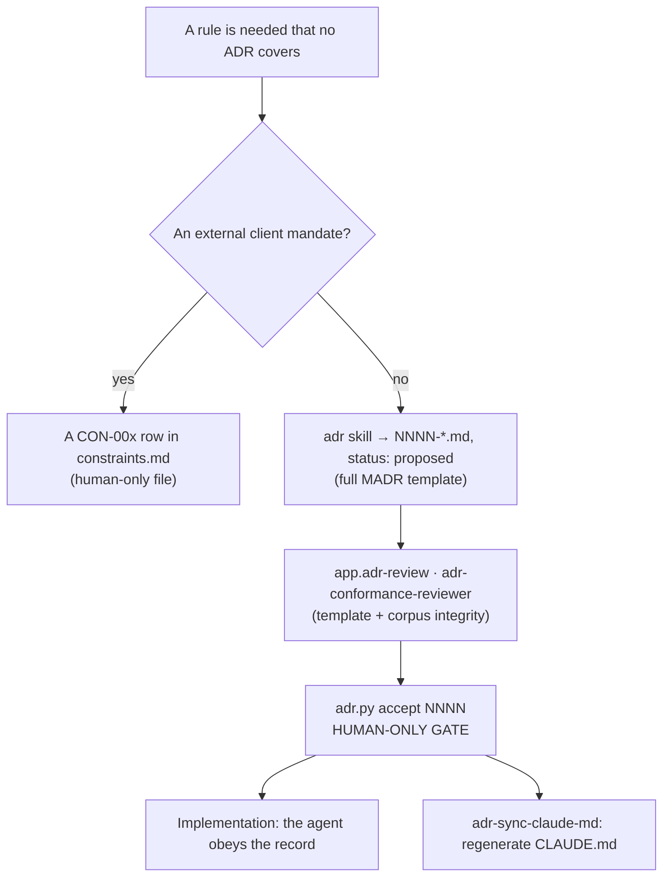
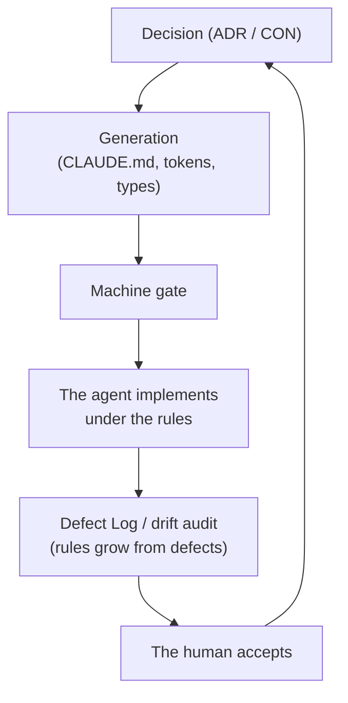

# Methodology

The methodology of this repository is not Agile or waterfall. It is **decisions-first development with an AI agent as the primary implementer under deterministic control**. This document explains the _process_ and the _roles_; the mechanisms that enforce them are described in [02 — Defense mechanisms](02-defense-mechanisms.md).

## The governing principle: decision first, then code

Nothing reaches the code without a covering decision. A rule the agent obeys _begins_ as a record ratified by a human.

When a change needs a decision that no ADR covers, the path is fixed:

Four properties make this process deterministic rather than trust-based:

- **Immutability.** An accepted ADR is never edited in place — only a new _superseding_ record with paired links (`adr.py supersede`). A PreToolUse hook physically blocks an edit to an accepted ADR.
- **Corpus integrity as a check in its own right.** `adr.py lint` verifies the numbering (unique, with no gaps), the cross-references, the required MADR sections, the absence of unfilled `{placeholder}` markers, the status vocabulary, and that the generated index `README.md` matches what is on disk.
- **A generated agent instruction.** [`CLAUDE.md`](../CLAUDE.md) is regenerated from the _accepted_ corpus by the `adr-sync-claude-md` skill and is not maintained by hand, so it cannot diverge from the decisions.
- **Human-only acceptance.** The agent can draft a record and review it, but never sets `status: accepted`. This is the first human gate.

### ADR versus constraint

An ADR records a _deliberate choice_ — at least two options considered, with a "Pros and Cons" section. An externally fixed mandate with no alternatives, such as React, Next.js, or the MCP set, is not a decision but a **constraint**: a `CON-00x` row in [`constraints.md`](decisions/constraints.md) that ADRs _cite_ by identifier rather than reopen.

## Roles: the AI implements, the human decides

The role model is fixed (ADR 0046/0047):

- **The AI agent is the primary implementer.** It writes most of the code under machine-checkable rules. Commit and PR attribution is left to the consuming project and is not mandated by the template.
- **Advisory AI is a first pass, not a replacement.** The jobs under [`scripts/ai/`](../scripts/ai) — PR review (0048), CI-failure triage (0049), changelog drafting (0050), Layer-2 security review (0056), and dependency-update triage (0057) — each cite ADR numbers and are **never required checks**. All stay inert until a human provisions `AI_API_KEY`.
- **The human is the judgment layer.** Every PR, whether from an agent or a human, requires at least one approval from a human other than the author, with stale approvals dismissed on a new push.

The full list of human-assigned actions is in [02 — Defense mechanisms](02-defense-mechanisms.md).

## Branching and delivery

The model is a lite git-flow (ADR 0011): **feature branches → `dev` (integration) → `main` (production, always deployable)**. Both target branches are protected, and the CI check is required. Production deploys from `main`, and every PR gets a Vercel preview URL (ADR 0009).

- **Conventional Commits are required** (commitlint, `check:commits`, ADR 0072), so the history is machine-processable and the AI drafts a changelog from it at the `dev → main` release (ADR 0050).
- **Deployment is not a CI responsibility.** CI is responsible for quality; Vercel builds the preview and production deploys through its git integration.

## The component creation cycle

The design system is the most regimented part of the methodology. The steps run in order (ADR 0058–0064):

1. **`ds:signature`** — before creation, check for a structural duplicate against the graph (P2).
2. **`design-intent.ts`** — at Definition-of-Ready, with the API derived from `usedIn` (not guessed) and the slot-versus-variant boundary recorded with a rationale.
3. **`ds:states`** — the archetype's mandatory state set, with coverage by subtraction (P8).
4. **Implementation and stories** — CSF 3; interactive components require play functions; stories double as tests (Storybook 10 with Vitest browser mode).
5. **`check:design-system`** — before committing: tokens, boundaries, graph, intent, seals, i18n, gates.
6. **`ds:escalations`** — before review: usage-role collisions, state-set deviations, and the auto-approval ratio for the human gates (P3/P8).

Four principles run through this cycle:

- **Coverage by subtraction.** The count starts from the archetype's complete mandatory state set, and each missing state requires a rationale: an `applicable: false` without a `rationale` is a disguised omission and is rejected. Silence does not count as a pass.
- **The API is derived from usage, not assigned arbitrarily.** A component's contract is the union of all `usedIn` requirements, and `check:design-intent` reconciles it against the real cva/union axes.
- **The allowed tokens are only the generated list** in `tokens.agent-rules.md`; tokens are never re-listed in prose.
- **Stories are tests.** Their coverage in browser mode counts toward the single ≥ 80% threshold. Purely presentational components are exempt from play functions; interactive ones are not.

## Application architecture: Feature-Sliced Design

The component layer is deeply standardized, but the application layer — where data access, state, and the UI of a feature and the page that ties them together live — had no separate standard: code would grow under `src/app` and `src/lib`, and the import direction would be checked by nothing. At scale this produces entropy — cross-feature coupling, a route imported from the UI, cycles — that review does not catch. Against it, the template adopts **Feature-Sliced Design** (ADR 0065, status `proposed`).

Application code is distributed across layers with the canonical names `shared`, `entities`, `features`, and `widgets`; the existing `src/app` (App Router) plays the app/pages role, and a separate `pages` layer is deliberately not introduced. Imports are allowed only downward through the hierarchy, slices within a layer are isolated, and each slice is reachable through its public `index.ts`. Direction and isolation are a gate, not an agreement: Steiger (`check:fsd`, ADR 0066), scoped to these layers, rejects an upward import, cross-slice access, or a bypass of the public API in CI, while dependency-cruiser (ADR 0060) holds the `src/components/**` boundary on a non-overlapping area.

- The placement of new code is determined by a deterministic decision tree (the `new-slice` skill) rather than chosen arbitrarily.
- A reusable shadcn primitive goes into `src/components/ui` (a kit outside FSD) through the `new-component` skill.
- FSD is added additively: the primitive kit, the governance artifacts in `src/design-system`, and the infrastructure in `src/lib` and `src/i18n` are not moved and stay outside the FSD area.

## State discipline: three non-overlapping categories

Each piece of client state has exactly one home, and placing it in the wrong category is precisely the error this model exists against (ADR 0025/0026/0027).

| Category     | Where it lives      | What it holds                                                                                               | Not for                                |
| ------------ | ------------------- | ----------------------------------------------------------------------------------------------------------- | -------------------------------------- |
| Server state | TanStack Query      | anything loaded from or written to the database — entities, lists, any data that can go stale               | UI toggles, URL state                  |
| URL state    | nuqs + typed routes | shareable, bookmarkable state that survives reload and back/forward — search, filters, sort, the active tab | secrets, large data, ephemeral toggles |
| Ephemeral UI | Zustand             | transient client state — whether a drawer or dialog is open, the current wizard step                        | anything server-owned or URL-owned     |

The hard rules are that server data is **never mirrored into Zustand**, optimistic state lives in the Query cache rather than Zustand, and Server Components **do not import the store**. Optimistic UI is the _default_ mutation pattern (`onMutate` → roll back on error → invalidate); a non-optimistic mutation needs an objective reason, justified in review.

## Validation and environment: a single authority

- **Zod is the single validation authority** (ADR 0017). Types are inferred from schemas (`z.infer`) rather than written separately; a hand-written interface that duplicates a schema is a review defect. Every boundary schema carries an origin marker (`[env]`, `[form:signup]`, …).
- **The same schema validates on the client and re-validates on the server** (ADR 0020), because the Server Action endpoint is reachable without going through the form.
- **The environment is read through two modules** rather than `process.env` directly: [`src/lib/env.ts`](../src/lib/env.ts) for the public `NEXT_PUBLIC_*` values, and [`src/lib/env.server.ts`](../src/lib/env.server.ts) for secrets behind a `server-only` fence, whose import into client code _fails the build_. Both modules validate immediately on import (ADR 0018).

## Data access: RLS as the boundary

Access goes through request-scoped `@supabase/ssr` clients, and all user-facing access runs **as the user under RLS** (`auth.uid()`). Row isolation is enforced by Postgres, not by application `where` clauses (ADR 0013). Migrations are plain SQL, including the RLS policies, under `supabase/` (ADR 0014); `gen:types` runs after every migration, and CI fails on drift (ADR 0015). The service-role key, which bypasses RLS, stays behind the `server-only` fence and never reaches the client. The `create-migration` skill and the `supabase-rls-reviewer` agent check the policy before the PR.

## The three feedback loops: defense against degradation

The rules are not fixed once and for all; they evolve from observed defects.

1. **The edit loop (seconds).** PostToolUse hooks show the lint and drift results at the moment a file is written, and the agent corrects itself immediately.
2. **Reactive growth (per wave).** The [Defect Log](design-system/defect-log.md) records every _missing or ambiguous_ rule, not every error. The invariant travels the path **prose → review-checkable Confirmation → executable Stage-1 gate on the first violation** (ADR 0064). The deterministic layer is built from real defects.
3. **The drift audit (scheduled).** The AI reconciles the Confirmation section of every accepted ADR with the real state of the repository and reports `confirmed`, `drifted`, or `unverifiable`. The human decides whether to fix the code or open a superseding ADR (ADR 0054).

This is evolutionary architecture in practice: the set of fitness functions is not static but **grows reactively**, so each new class of failure, once it appears, gets its own gate.

## Managed deviations (lean bootstrap)

The methodology allows _temporary_ deviations from an accepted ADR, but only explicitly and on the record. While the template has no product code, the heavy suites — Playwright e2e with migration replay, and the Storybook test-runner smoke — run **locally** rather than in CI, for speed. Each deviation is recorded in the [deviation journal](deviations.md) with a concrete return condition (before the first `dev → main` promotion) and is **not** a change to an ADR: the recorded decision remains the target state.

A deviation is admissible only if it departs from an _accepted_ ADR, is temporary, and names a concrete return trigger. A permanent change requires a superseding ADR.

## The methodology in one diagram

The cycle closes on itself: a human-accepted decision is generated into the artifacts the agent obeys, a gate enforces them, the agent implements under them, and the defects observed along the way feed back into new rules and the next decision.

